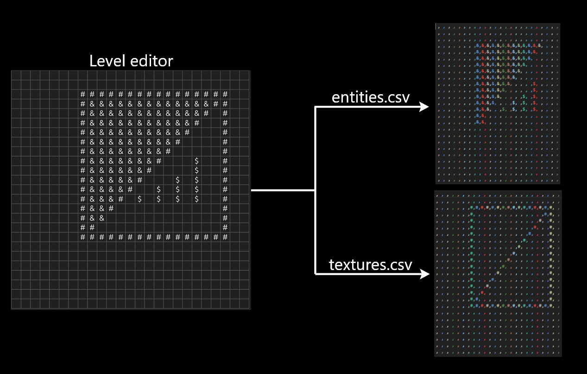

# Level Editor

Level Editor is a simple, grid-based level design tool built in Rust using Egui. It provides a visual interface to quickly design levels by painting directly on a grid, with options for walls, enemies, checkpoints, and more. Once your level is designed, it can be exported as two csv's containing texture and entity data respectively.

| ASCII Symbol | Description          |
|--------------|----------------------|
| `#`          | Wall tile            |
| `&`          | Enemy                |
| `!`          | Checkpoint           |
| `$`          | Fruit / Prize                |
| (space)      | Empty / Cleared cell |

## Download

Get the latest release here:  
[Download Level Editor](https://github.com/MistaNewVegas/ASCII-level-designer/blob/main/Daniel's%20ASCII%20Level%20Editor.exe)

## Usage

- **Run:**  
  - Execute via `cargo run --release`  
  - Or run the built executable from the link above
- **Editing:**  
  - Use the toolbar to select a brush (Wall, Enemy, Checkpoint, Fruit, or Clear).
  - Left-click or drag over cells to paint.
  - [REMOVED] Shift + right-click clears a cell.
- **Export:**  
  - Click "Export to CSV" to save your level design as CSV files.

## Output

